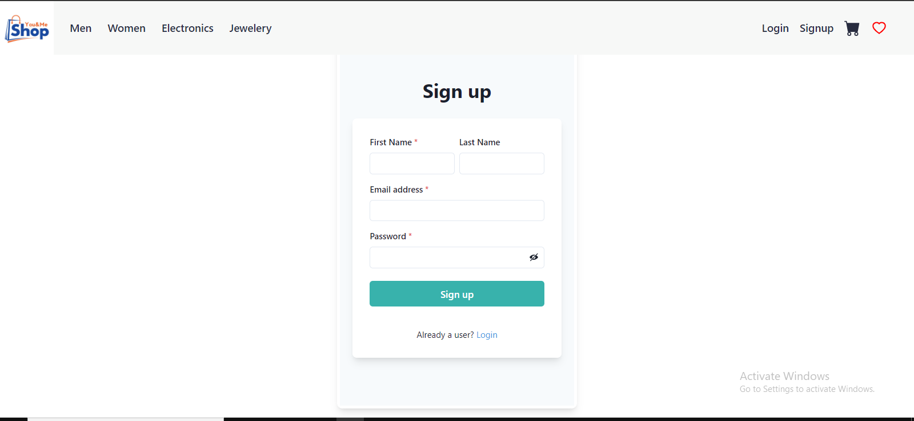
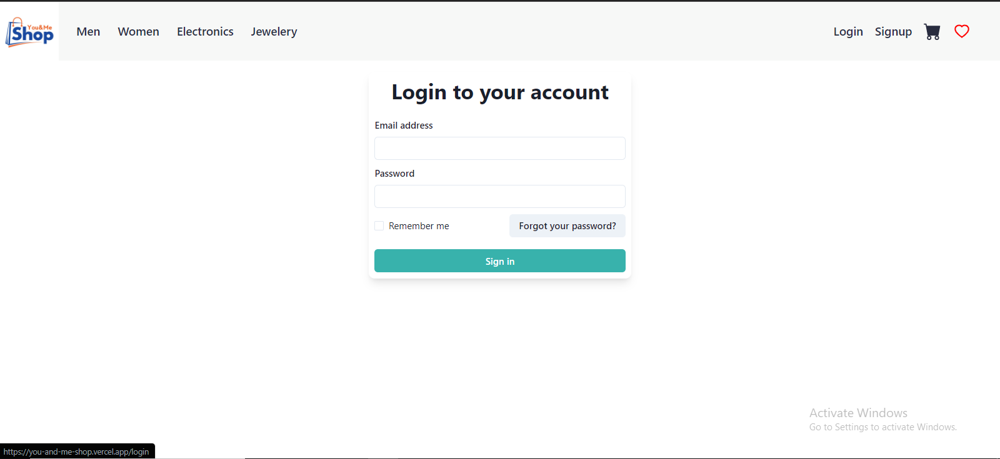
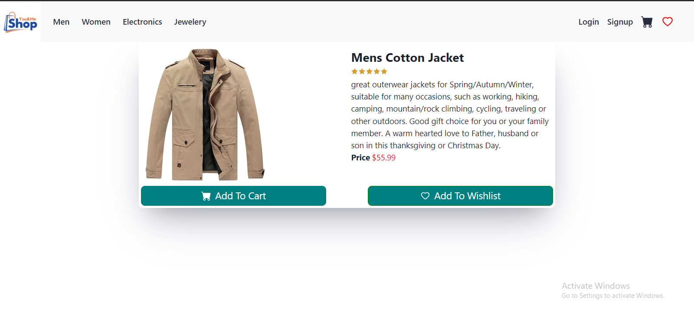
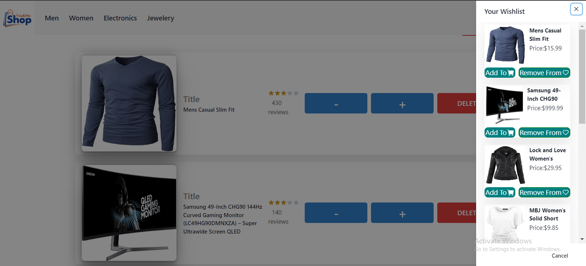
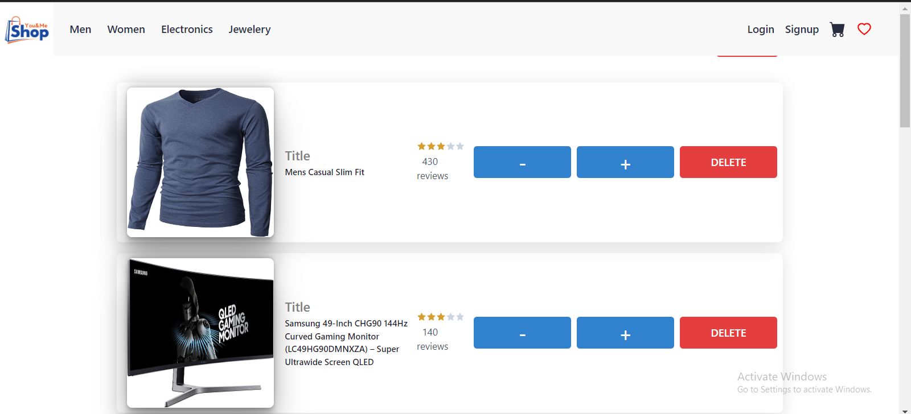

# You-and-me shop

You-and-me shop is an online store.where anyone can purchase any clothes,electronics and jeweleries products from here

## About this project.

This project is built by me only.All designing, feature and styling implemented by my own

Deployment link:- https://you-and-me-shop.vercel.app/

## Team of 1 Member.
1. Mr. Ashwani Sahu.

## Pages and Features

### Home Page

It contains Navigation bar with different categories. Also it shows images of some latest products.

## Signup and Login 

On this page, user can signup and after successfully signin up he can login.

### Product detail page

On clicking any of the product it will redirect to the product Details page which shows detailed information of the product along with button such as add to Cart.

### Wishlist

on Clicking wishlist icon or add to wishlist this drawer opens.user can delete from here itself or either they can add to the Cart as well

### Cart page

On cart page customer can see the order summary and also customer can increase and decrease the quantity of the product.

## Tech Stack:

1. React.js
2. Redux
3. ChakraUi
4. Json-Server

## Tools Used

###### • Github.

## Feedback:

If you want to suggest me anything or want to give me feedback then please connect us at:

ashsahu627@gmail.com

